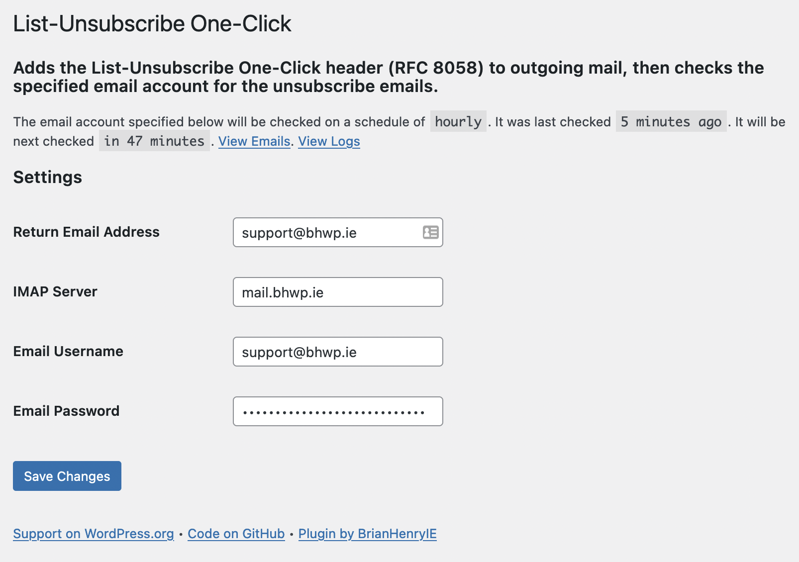

 

# One-Click List-Unsubscribe Mailto: Header

Most/all bulk email solutions add the `List-Unsubscribe` header to mailing list emails which allows "one-click" unsubscriptions, wherein the mail client sends a HTTP POST request to the specified address which then unsubscribes the user from the list. Another standard in use is to add a `mailto:` address in which the mail client sends an email to the specified address and it is expected the user will be unsubscribed.

This plugin adds the latter approach to outgoing email from WordPress plugins [The Newsletter Plugin](https://wordpress.org/plugins/newsletter/) and [MailPoet](https://wordpress.org/plugins/mailpoet/), and to any emails sent via WordPress's standard mailer `wp_mail()` which already contain the `List-Unsubscribe` header with a HTTPS link. 

The HTTPS link is encoded in base64 and added to the subject of the `mailto:` portion of the header. Then the specified email adddress is polled hourly and when an email's subject matches the expected `unsubscribe:BASE64URL` a request is sent to the URL which unsubscribes the user. 

## RFCs

* [RFC2369: The Use of URLs as Meta-Syntax for Core Mail List Commands and their Transport through Message Header Fields](https://tools.ietf.org/html/rfc2369)
* [RFC8058: Signaling One-Click Functionality for List Email Headers](https://tools.ietf.org/html/rfc8058)

## NB

> the message MUST have a valid DomainKeys Identified Mail (DKIM) signature

## Status

This has been in use in production for months/years with The Newsletter Plugin. 

It was updated to use with [Newsletter Glue](https://newsletterglue.com/) via [brianhenryie/bh-wp-ngl-wp-mail](https://github.com/BrianHenryIE/bh-wp-ngl-wp-mail)

MailPoet support is unfinished. It hooks into MailPoet's AJAX actions but needs to also hook into its cron actions. 